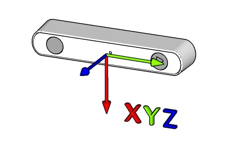

<h1 align="center">
  ZED Open Capture (macOS)
</h1>

<h4 align="center">A macOS camera and sensor capture API for the <a href="https://www.stereolabs.com/products/zed-2">ZED 2i, ZED 2, and ZED Mini</a> stereo cameras</h4>
<h5 align="center">*** not compatible with GMSL2 devices: <a href="https://www.stereolabs.com/products/zed-x">ZED X, ZED X Mini, and ZED X One</a> ***</h5>

<p align="center">
  <a href="#features">Features</a> •
  <a href="#install">Install</a> •
  <a href="#run">Run</a> • 
  <a href="#examples">Examples</a> •
  <a href="#documentation">Documentation</a> •
  <a href="#related">Related</a> •
</p>
<br>

## Features

- Open source C++20 capture library
- Video data
    - YUV 4:2:2
    - Greyscale
    - RGB
- Sensor data
    - TODO

### Description

The ZED Open Capture library is a macOS library for low-level camera and sensor capture for the ZED stereo camera family.

The open-source library provides methods to access raw video frames, calibration data, camera controls, and raw data from the USB3 camera sensors. A synchronization mechanism is provided to get the correct sensor data associated with a video frame.

**Note:** While in the ZED SDK all output data is calibrated and compensated, here the extracted raw data is not corrected by the camera and sensor calibration parameters. You can retrieve camera and sensor calibration data using the [ZED SDK](https://www.stereolabs.com/docs/video/camera-calibration/) to correct your camera data [see `zed_open_capture_rectify_example` example](#running-the-examples).

## Install

### Prerequisites

 * Stereolabs USB3 Stereo camera: [ZED 2i](https://www.stereolabs.com/zed-2i/), [ZED 2](https://www.stereolabs.com/zed-2/), [ZED Mini](https://www.stereolabs.com/zed-mini/)
 * macOS (>= 15)
 * Clang (>= 19) (Xcode or Homebrew)
 * CMake (>= 3.31)
 * OpenCV (>= 4.10) (Optional: for examples) 

### Install prerequisites

- Install clang via Xcode
```zsh
xcode-select -install
```

- Install clang via Homebrew (optional)
```zsh
brew install llvm

# Add to ~/.zshrc to prefer homebrew clang
export PATH="/opt/homebrew/opt/llvm/bin:$PATH"
export CC=$(which clang)
export CXX=$(which clang++)
```

- Install CMake build system
```zsh
brew install cmake
```

- Install OpenCV to build the examples (optional)
```zsh
brew install opencv
```

### Clone the repository

```zsh
git clone https://github.com/christianbator/zed-open-capture-mac.git
cd zed-open-capture-mac
```

### Build the library

```zsh
cmake -B build
cmake --build build --config Release
sudo cmake --install build
```

### Install the library

```zsh
sudo cmake --install build
```

### Uninstall the library

```zsh
sudo rm -r /opt/stereolabs
```

## Run

### Video capture

Starting the capture:
```C++
// Include the header
#include "zed_video_capture.hpp"

// Create a video capture instance
VideoCapture videoCapture;

// Open the stream with a colorspace (YUV, GREYSCALE, or RGB)
videoCapture.open(RGB);

// Start the capture, passing a closure or function that's invoked for each frame
videoCapture.start([](uint8_t *data, size_t height, size_t width, size_t channels) {
    //
    // `data` is an interleaved pixel buffer in the specified colorspace
    // `data` is (height * width * channels) bytes long
    //  
    // Process `data` here
    //
});

// Keep the process alive while processing frames
while (true) {
    // For example, with OpenCV:
    cv::waitKey(1);
}
```

Stopping the capture:
```c++

// Stop the capture at any point
videoCapture.stop();

// Close the capture stream at any point
videoCapture.close();
```

### Sensor data

TODO...

#### Coordinate system

The given IMU and magnetometer data are expressed in the coordinate system shown below:



## Examples

Make sure you've built and installed the library with:

```zsh
cmake -B build
cmake --build build --config Release
sudo cmake --install build
```

Then you can build the examples with:

```zsh
cd examples
cmake -B build
cmake --build build
```

The following examples are built:
- opencv_video_stream
  - Usage: `./opencv_video_stream (yuv | greyscale | rgb)`
  - Displays the connected ZED camera feed with OpenCV with the desired colorspace 

## Documentation

TODO...

## Related

- [Stereolabs](https://www.stereolabs.com)
- [ZED 2i multi-sensor camera](https://www.stereolabs.com/zed-2i/)
- [ZED SDK](https://www.stereolabs.com/developers/)
